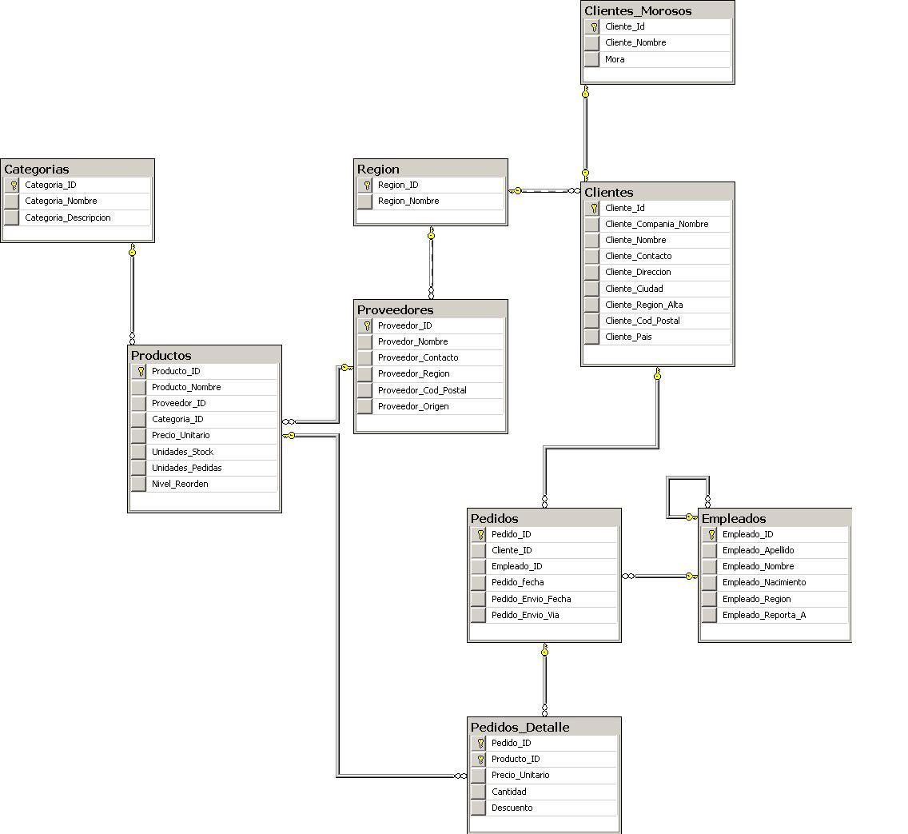

# Realizar las siguientes consultas

- **Obtener el listado de todos los productos ordenados por Nombre del Producto.**

_mostrar: Nombre del Producto, Precio Unitario_

- **Obtener el listado de la cantidad total de unidades para cada pedido  **

_mostrar: Pedido, Cantidad_

- **Obtener el listado de todos los productos cuyo precio unitario se encuentre entre 10 y 15**

_mostrar: Nombre del Producto_

- **Obtener el mayor descuento realizado en algún pedido**

_mostrar: Descuento_

- **Obtener el listado de todos los pedidos realizados en el año 1998**

_mostrar: Todos los campos de Pedido_

- **Obtener la cantidad de productos que tiene cada categoría.**

_mostrar: Descripción de la Categoría, Cantidad de Productos_

- **Obtener el listado  de todos los empleados cuyo nombre comienzan con 'M'.**

_mostrar: Nombre y Apellido del Empleado (En la misma columna)_

- **Obtener el nombre del producto cuyo precio unitario sea el mayor**

_mostrar: Nombre del Producto, Precio Unitario_

- ** Crear un Stored Procedure 'Actualiza_Precio’' que aumente en un 10% el valor de los precios unitarios**

- **Crear un Stored Procedure 'Actualiza_Descuento’' para que reciba por parámetro un valor de descuento a realizar y lo sume al ya existente, sólo a los pedidos de los clientes de Alaska, Costa Dorada y California.**

- **Listar la cantidad de unidades en stock para cada uno de los productos que pertenecen a una categoría**

_mostrar:  Descripción de la categoría, Cantidad de unidades en stock_

- **Listar todos los productos y la categoría a la que pertenecen. Para las categorías desconocidas informar 'Sin Categoría'**

_mostrar: Nombre del Producto, Nombre de la Categoría_

- **Listar las regiones que aún no cuenten con un proveedor**

Mostrar : Nombre de la Región

- **Listar los clientes que no entraron en mora**

_mostrar: Nombre del cliente, Contacto del cliente_

- **Listar el monto total de mora de los clientes Antonio Moreno y Maria Anders**

_mostrar: Monto total de mora (De ambos clilentes)_

- **Listar el monto total de descuento aplicado a los clientes no morosos. Agrupar el listado por cada una de las categorías conocidas y no conocidas. En el último caso informar Sin Categoría.**

_mostrar: Nombre de la Categoría, Descuento._

- ** Listar a todos los empleados y a su jefe (Según a quién reporta el empleado)**

Mostrar : Nombre del Empleado, Nombre del Jefe

- **Listar a todos los empleados y a su jefe (Según a quién reporta el empleado). Para el caso de los empleados que no reportan a nadie informar "Sin Jefe"**

Mostrar : Nombre del Empleado, Nombre del Jefe

- **Obtener el monto total al que ascienden todos los pedidos de los clientes cuyas regiones tienen proveedor, agrupado por producto y empleado**

_mostrar: Nombre de Empleado, Nombre de Producto, Monto_

- **Crear una tabla llamada Clientes_Inactivos**

    * Campos:

        - Cliente_Id nchar(5) not null,
        - Cliente_Nombre varchar(20) null

- **Insertar en la tabla Clientes_Inactivos a aquellos clientes que no hayan realizado pedidos**

## Levantar el proyecto 

- `make` : Levantar toda la base  de datos con la insercion de los datos
- `make access`: Acceso de la base de datos por medio de la terminal
- `make down`: Dar de baja el servicio 
